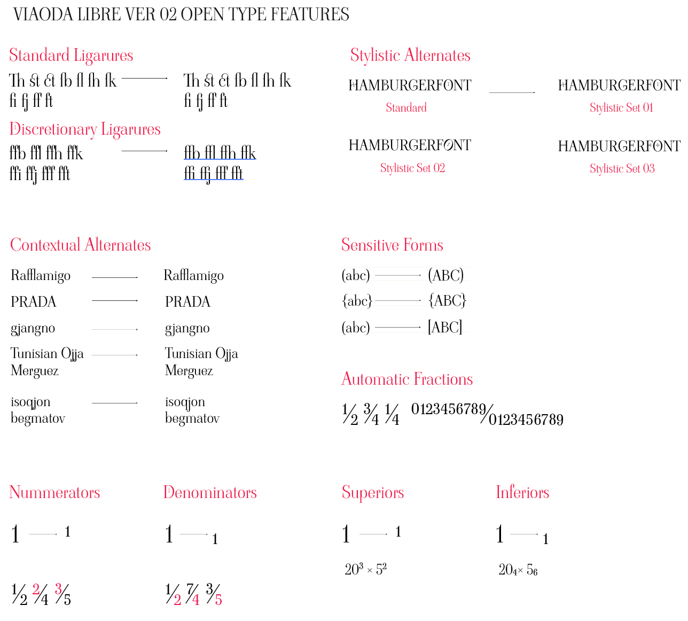
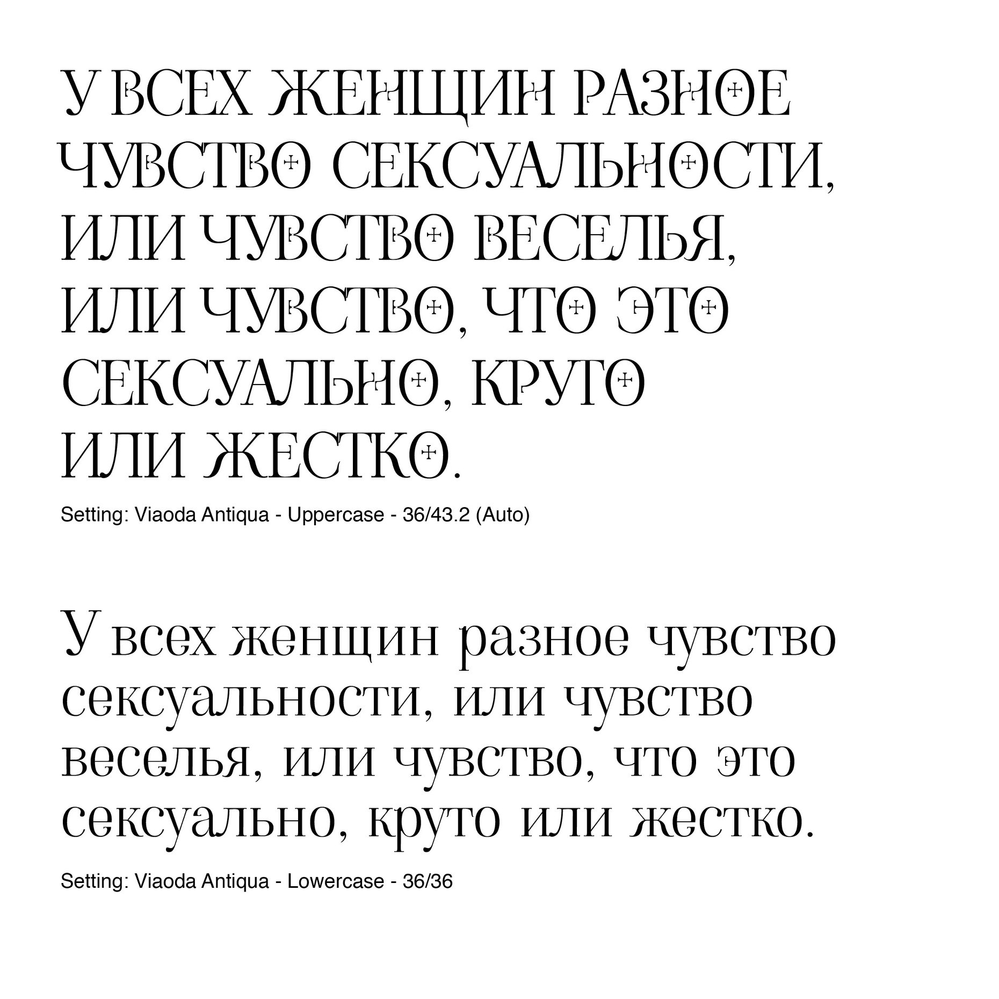
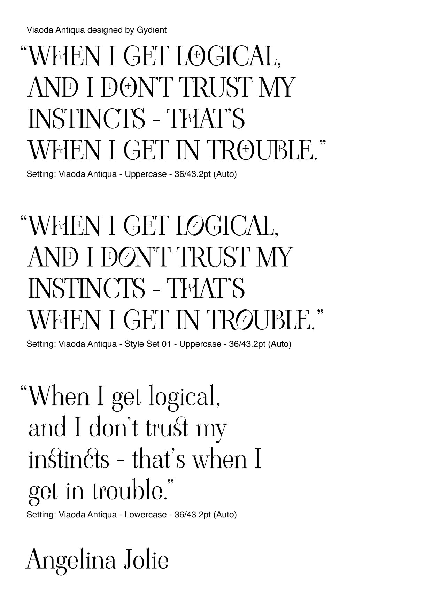
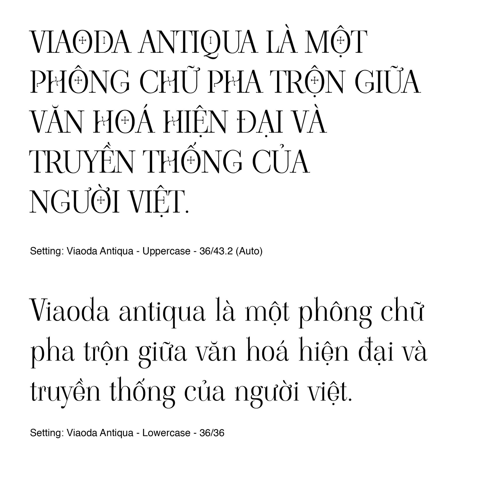

# ViaodaLibre

Viaoda Libre is a display font. Inspired by Vietnamese cultural symbolism,
Viaoda Libre is a mix of both the old and the new, appearing with traditional
elegance and modern professionalism at the same time. It is designed to
match media publications regarding tradition while also serve as titles and
subtitles. The typeface is to be further developed in the future, with hopes to
attain greater values for Vietnamese typeface.

Typeface: Viaoda Libre

Type & Graphic Design: [Gydient](https://gydient.com) (Giang Nguyen)

Copywriting: Minh Pham

Type Engineer: Vietanh D. Nguyen

### Version 2.000

### Version 1.000

## Changelog

### Version 2.000

- The number of glyphs increased to 898.
- Simplified the previously decorated O and H and instead created two stylistic sets such glyphs.
- Refined kerning for latin and cyrillic sets.
- Tweaked punctuation.

### Version 1.000

- Make available on Github.
